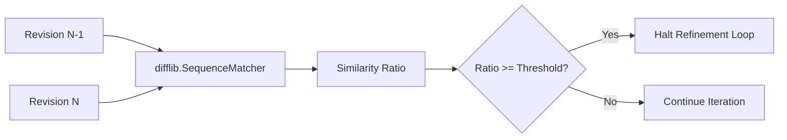

# genpark-iterative-refinement-convergence-detector-skill

Sequence matcher and convergence detector monitoring edit distance between sequential agent refinement iterations.

## Architecture

## Features
- **Oscillation Detection**: Prevents infinite ping-pong edits.
- **Pure Python**: 100% Standard Library.
